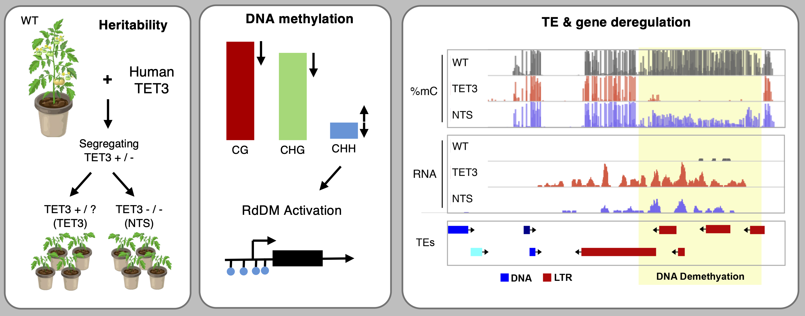

# Enzymatic DNA demethylation enables the formation of stable epimutations in tomato

Analysis repository for Antunez-Sanchez et al., containing traceable code and rendered notebook reports for WGBS screening, deep WGBS, and RNA-seq/TE analyses.

## Associated article

Antunez-Sanchez J, Engelhorn J, Lopez-Gomollon S, Meyer P, Gutierrez-Marcos J. Enzymatic DNA demethylation enables the formation of stable epimutations in tomato. Journal of Experimental Botany. Published 10 March 2026. https://doi.org/10.1093/jxb/erag132

## Graphical abstract

## Repository layout

- `1_WGBS-screening/`: Screening-level WGBS analyses (code, rendered reports, processed data)
- `2_WGBS-deep/`: Deep WGBS analyses and manuscript Figure 2/3 figure-generation scripts
- `3_RNAseq/`: RNA-seq processing, TEcount pipeline, and downstream RNA/TE integration analyses

Each analysis directory is structured as:

- `code/`: `.Rmd`, `.R`, and `.sbatch` analysis code
- `reports/`: `.nb.html` rendered notebook reports (intentionally versioned)
- `data/`: processed tables and intermediate data objects used by analyses

## Data availability

- GEO accession: **GSE303457**
- Public GEO record: [https://www.ncbi.nlm.nih.gov/geo/query/acc.cgi?acc=GSE303457](https://www.ncbi.nlm.nih.gov/geo/query/acc.cgi?acc=GSE303457)

## Software requirements

- R >= 4.0
- R packages explicitly loaded in the committed code include `tidyverse`, `DESeq2`, `DMRcaller`, `plyranges`, `cowplot`, `patchwork`, `ggforce`, `ggbeeswarm`, `ggrastr`, `ggblend`, `ComplexHeatmap`, `tidyHeatmap`, `EnhancedVolcano`, `GeneOverlap`, `gprofiler2`, `kableExtra`, `shadowtext`, `slider`, `scales`, `magrittr`, `RColorBrewer`, `ggpubr`, `rstatix`, `multcomp`, `multcompView`, `betareg`, and `tictoc`
- STAR
- Bismark
- TEtranscripts / TEcount
- FastQC
- Trim Galore
- samtools

## Execution environment

- Scripts were executed on Linux HPC infrastructure using **SLURM** job scheduling.
- Absolute machine-specific paths were replaced with neutral placeholders (e.g., `/path/to/project/`, `/path/to/genome/`, `/path/to/data/`) to support adaptation to local environments.
- Rendered `.nb.html` notebook outputs are included intentionally as browsable analysis reports for readers and reviewers.
